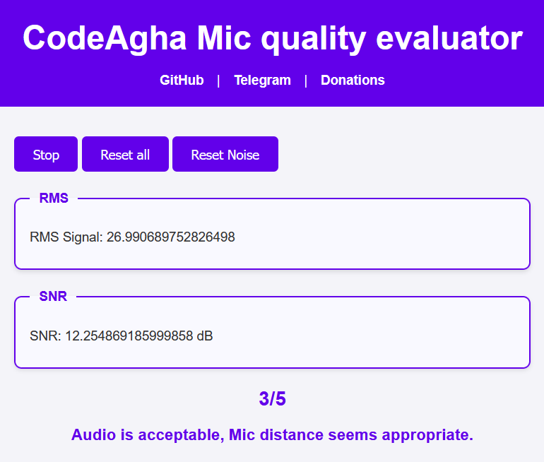

# 🎧 Microphone Signal Quality Analyzer for JavaScript

A lightweight in-browser tool for evaluating **microphone signal quality** using the Web Audio API. It is designed to help users prepare optimal audio input for **speech-to-text models** such as Whisper, VOSK, or DeepSpeech — without requiring control over gain settings.

## Install and usage 
```bash
npm i microphone-quality-evaloution@latest
```



[Persian Version](./docs/README_Fa.md)


---

## 🔍 Overview

This tool analyzes real-time microphone input and gives simple advice based on:

- **RMS (Root Mean Square)** energy of your voice
- **SNR (Signal-to-Noise Ratio)** in the speech frequency band
- **Power of the voice signal** and **background noise**
- User behavior (e.g., speaking too softly or loudly)

The output is a short recommendation message, suitable for everyday users (no technical terms), along with a 1–5 mic quality score.

---

## How to use?

This is the source of this page 
```javascript
// main.js
import { AudioProcessor } from "./audioProcessor.js";

const processor = new AudioProcessor(2000, 250, 4000, false);

const toggleRecordButton = document.querySelector('#toggleRecord');
const toggleResetButton = document.querySelector('#btnReset');
const toggleResetNoiseButton = document.querySelector('#btnResetNoise');
const statusRMS = document.querySelector('#statusRMS');
const statusSNR = document.querySelector('#statusSNR');
const statusQuality = document.querySelector('#quality');
const statusAdvice = document.querySelector('#adviece');

let recording = false;
const RECORD = 'Record';
const STOP = 'Stop';

// Start/Stop recording
toggleRecordButton.addEventListener("click", async () => {
  recording = !recording;
  if (recording) {
    toggleRecordButton.innerHTML = STOP;
    try {
      await processor.start();
      console.log("Start processing...");
    } catch (err) {
      console.error("An error in start processing: ", err);
      statusRMS.innerHTML = `Error: ${err.message}`;
    }
  } else {
    toggleRecordButton.innerHTML = RECORD;
    statusRMS.innerHTML = "Click on Record button and wait for processing noise...";
    statusSNR.innerHTML = "...";
    processor.stop();
  }
});


toggleResetButton.addEventListener("click", () => {
  processor.resetMeasurements();
  recording = false;
  processor.stop();
  toggleRecordButton.innerHTML = RECORD;
  statusRMS.innerHTML = "Click on Record button and wait...";
  statusSNR.innerHTML = "...";
});

toggleResetNoiseButton.addEventListener("click", () => {
  processor.resetMeasurements();
  console.log("Noise and signals are resets...");
});


processor.addEventListener("update", (event) => {
  const { rmsSignal, rmsNoise, snr, noiseMode, timestamp } = event.detail;
  const {message,micQuality} = generateAudioAdvice(snr, rmsSignal);
  
  if (noiseMode) {
    statusRMS.innerHTML = `Messuring noise<br/>RMS Noise: ${rmsNoise}`;
    statusSNR.innerHTML = `SNR: --`;
  } else {
    statusRMS.innerHTML = `RMS Signal: ${rmsSignal}`;
    statusSNR.innerHTML = `SNR: ${snr} dB`;
    statusAdvice.innerHTML = message;
    statusQuality.innerHTML = `${micQuality}/5`
  }
  console.log("بروزرسانی در", new Date(timestamp).toLocaleTimeString(), event.detail);
});


function generateAudioAdvice(snr, rms) {
  let advice = "";
  let micQuality = 0;

  // Evaluate recording quality based on SNR
  if (snr >= 18) {
    advice += "Audio is excellent, ";
    micQuality = 5;
  } else if (snr >= 15) {
    advice += "Audio is good, ";
    micQuality = 4;
  } else if (snr >= 10) {
    advice += "Audio is acceptable, ";
    micQuality = 3;
  } else if (snr >= 5) {
    advice += "Audio is not ideal. Record in a quieter environment, ";
    micQuality = 2;
  } else {
    advice += "Audio is poor; your speech may not be processed correctly, ";
    micQuality = 1;
  }

  // Check the recorded audio level (RMS)
  console.log("RMS: ", rms);
  
  if (rms > 120) {
    advice += "Sound is too loud and may cause noise.";
    if (micQuality > 1) micQuality--;
  } else if (rms < 6) {
    advice += "Adjust the microphone distance.";
    if (micQuality > 1) micQuality--;
  } else {
    advice += "Mic distance seems appropriate.";
  }

  return { message: advice.trim(), micQuality: micQuality };
}
```

---

## 🧠 Signal Processing works

The tool uses a chain of Web Audio nodes for analysis:

1. **`MediaStreamSource`** — receives live audio input from the microphone.
2. **`BiquadFilterNode`** (bandpass) — isolates the frequency range typical of human speech:
   - Frequency range: **250 Hz to 4000 Hz**
   - Center frequency: $`\frac{(250 + 4000)}{2} = 2125 Hz`$
   - Quality factor: $`Q = \frac{center frequency}{bandwidth}`$
3. **`AnalyserNode`** — uses FFT (size 16384) to measure the frequency-domain energy.

Every 2 seconds:
- Computes **RMS** over the target frequency band
- Estimates power of the **voice** and **background noise**
- Calculates **SNR (in dB)** using:

  $`\text{SNR}_{dB} = 10 \cdot \log_{10}\left(\frac{P_{\text{signal}}}{P_{\text{noise}}}\right)`$

---

## ✅ What Makes “Good” Audio?

| Metric | Good Range        | Notes                                               |
|--------|-------------------|-----------------------------------------------------|
| RMS    | ~20 to 70         | Too low = weak voice; too high = possible clipping |
| SNR    | > 15 dB (ideal 18+) | Lower SNR indicates high noise or weak speech     |

Users are advised to:
- Speak clearly, at a moderate volume
- Move closer to the mic if needed
- Reduce ambient noise (e.g., fans, traffic)

No gain or hardware control is assumed.

---

## 🗣️ Output Example

The tool displays:
- A brief **recommendation message** (e.g. “Your voice is too quiet”)
- **SNR value** and **RMS level**
- A **mic quality score** between 1 (poor) and 5 (excellent)

---

## ⚙️ Designed For

- Pre-checking mic setup for **speech recognition**
- Ensuring recording conditions are within **model-friendly bounds**
- Real-time use in web-based voice tools

---

## 🚀 Future Improvements

- Adaptive multi-band filters for more precise isolation  
- ML-based noise profiling and environment classification  
- User-specific calibration (tracking speaking habits over time)

---

## 📎 Dependencies

- Web platform only  
- No external JS libraries required  
- Fully client-side, secure and lightweight  

---

> 🧪 Built for experimentation, prototyping, and real-world speech applications.


With ❤️&☕ by codeagha
